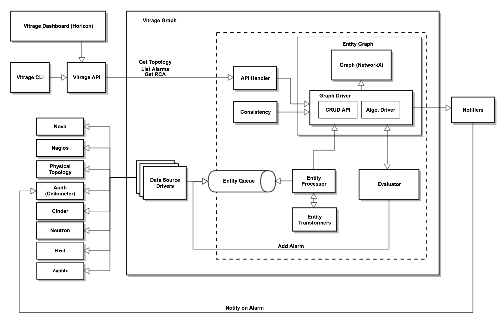

====================
Vitrage Graph Design
====================

Main Components
===============

Graph
-----
A library with a graph representation, that is used by Vitrage Graph and by
Vitrage Evaluator.

The **Graph Driver** consists of APIs for graph CRUD operations (add/remove
vertex, add/remove edge, etc.) and graph algorithms for iteration and pattern
detection. In Mitaka, the graph driver will be implemented in-memory over
NetworkX (https://networkx.github.io/). Future versions should support
replacing NetworkX with a persistent graph DB such as Titan or Neo4J.

Datasources
-----------
Vitrage can support multiple *datasources* to populate its graph. Each
datasource is responsible for importing information regarding certain entities
in the cloud and defining how to integrate their information into the graph.
Entities in this context refer both to resources (physical & virtual) and
alarms (Aodh, Nagios, Monasca, etc.)

The datasource is comprised of two components. The *Driver* handles retrieving
the information and entering it into the entity queue, while the *Transformer*
defines how to integrate the information retrieved into the graph (for more
details about the Transformer, see next section).

The datasource *driver* has two modes of operation:

- *get_all* (snapshot): Pull-based operation. Query all entities for this
  datasource and send events to the queue. When done, send an "end" event.
- *notify*: Push-based operation. When change occurs, send an event to the
  queue.

Entity Processor and Transformers
---------------------------------
The Entity Processor is responsible for polling events from the entity queue
and inserting corresponding vertices to the Graph. For every entity event in
the queue, the Processor calls the Transformer that is registered on this
entity type. For each datasource there is a Transformer, which understands the
specific entity details. It queries the graph, and after processing outputs a
vertex to be inserted to the Graph together with edges that connect it to its
neighbors in the graph.

Evaluator
---------
The Evaluator is notified on every change in the Graph, and is responsible for
executing templates that are related to this change.

Template Examples:

- Deduced alarm: In case an alarm is raised indicating a public switch is down,
  trigger an "instance is at risk" alarm on every instance that is contained by
  a host attached to this switch.
- Deduced state: In case an alarm is raised indicating a public switch is down,
  set the state of every instance that is contained by a host attached to this
  switch to be "suboptimal".
- Causal relationship: In case an alarm is raised indicating a public switch is
  down, and an "instance is at risk" alarm is active on an instance that is
  contained by a host attached to this switch - determine that the switch alarm
  is the root cause of the instance alarm, and add a "causes" edge to the Graph
  from the vertex representing the switch to the vertex representing the
  instance.

Templates can be added, removed or modified by the user.

Consistency
-----------
This component is responsible for verifying the Graph's consistency with the
actual situation in the cloud. It is called both during Vitrage startup, as
part of the graph initialization, as well as periodically to ensure the graph
is correct.

The consistency component will include:

- Deleting obsolete vertices
- Handle the case that Vitrage missed a "delete entity" event, and did not
  delete certain deduced alarms.
- Ensure no entity is missed in the Graph. This can be done by retrieving all
  entities from all datasources.

**Note:** If an entity is added, its related templates will also be executed
as well to create deduced alarms and add RCA information to the graph.

API Handler
-----------
The API handler is responsible for transferring Vitrage API calls to the Graph.

Notifiers
---------
The notifier is responsible for notifying registered external components of
changes that took place in the graph. For example, external OpenStack projects
such as Aodh/Monasca could have a notifier to notify them about deduced alarms.
Each notifier is responsible to notify another component.

