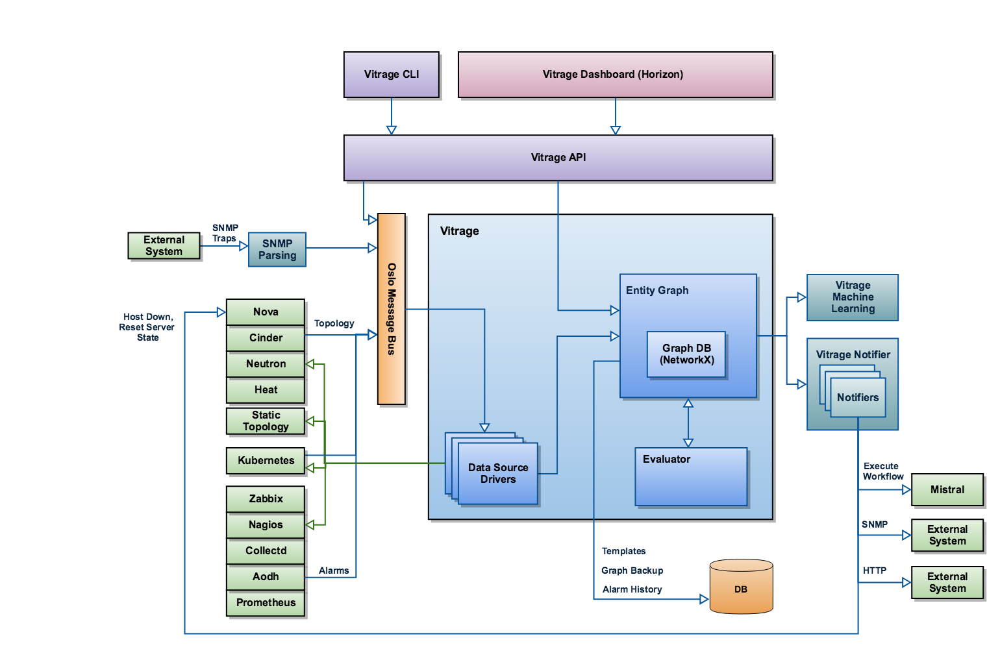

.. vitrage documentation master file, created by
   sphinx-quickstart on Tue Jul  9 22:26:36 2013.
   You can adapt this file completely to your liking, but it should at least
   contain the root `toctree` directive.

Welcome to Vitrage documentation!
=================================

Vitrage is the OpenStack RCA (Root Cause Analysis) service for organizing,
analyzing and expanding OpenStack alarms & events, yielding insights regarding
the root cause of problems and deducing their existence before they are
directly detected.

High Level Functionality
------------------------

* Physical-to-Virtual entities mapping

* Deduced alarms and states (i.e., raising an alarm or modifying a state based on analysis of the system, instead of direct monitoring)

* Root Cause Analysis (RCA) for alarms/events

* Horizon plugin for the above features

High Level Architecture
-----------------------

**Vitrage Data Sources** are responsible for importing information from
different sources, regarding the state of the system. This includes information
regarding resources (physical, virtual, and applications) and alarms.
The information is then processed into the Vitrage Graph.
Currently Vitrage supports OpenStack datasources like Nova, Cinder, Neutron,
Heat and Aodh, as well as external monitors like Nagios, Zabbix and collectd.

**Vitrage Graph** holds the information collected by the Data Sources, as well
as their inter-relations. Additionally, it implements a collection of basic
graph algorithms that are used by the Vitrage Evaluator (e.g., sub-matching,
BFS, DFS etc).

**Vitrage Evaluator** coordinates the analysis of (changes to) the Vitrage
Graph and processes the results of this analysis. It is responsible for
executing different kind of template-based actions in Vitrage, such as to add
an RCA (Root Cause Analysis) relationship between alarms, raise a deduced alarm
or set a deduced state.

**Vitrage Notifiers** can be used to notify external systems of Vitrage alarms
and states. The following notifiers are currently supported: Nova (update the
states of the host and instances), Mistral (execute workflows), SNMP and HTTP
webhooks.

Installation Guide
------------------
.. toctree::
   :maxdepth: 1

   install/index

Developer Guide
---------------

.. # NOTE(ifat-afek): Hide files we don't want to see in the table of contents.
   # sphinx build fails if a file is not included in the toctree.
.. toctree::
   :hidden:
   
   contributor/index

.. toctree::
   :maxdepth: 1

   contributor/vitrage-first_steps
   contributor/vitrage-api
   contributor/vitrage-template-format
   contributor/devstack-installation
   contributor/configuration

Design Documents
----------------

.. toctree::
   :maxdepth: 1

   contributor/vitrage-graph-design
   contributor/scenario-evaluator
   contributor/vitrage-use-cases
   contributor/add-new-datasource
   contributor/not_operator_support
   contributor/templates-loading
   contributor/vitrage-ha-and-history-vision
   contributor/datasource-snmp-parsing-support
