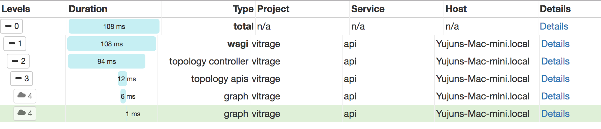

==================
Configure profiler
==================

Overview
========

`osprofiler`_, the Cross-project profiling library for OpenStack, is integrated in Vitrage to generate 1 trace per
request, that goes through all involved services.

.. _osprofiler: https://docs.openstack.org/osprofiler/latest/

Configuration
=============

Profiling must be enabled **explicitly** in Vitrage configuration file::

    [profiler]

    enabled = true
    hmac_keys = SECRET_KEY
    #connection_string = messaging://

- ``hmac_key`` will be used in client to sign a request with profiling enabled
- ``connection_string`` specify the storage driver to collect tracing data, default to ceilometer via messaging

Please refer to `osprofiler user manual`_ for details

.. _osprofiler user manual: https://docs.openstack.org/osprofiler/latest/user/index.html

Usage
=====

Use ``--profile`` option in Vitrage CLI to send a request with profiling enabled, e.g.::

    vitrage --profile SECRET_KEY topology show

The key must match the `hmac_keys` configured in the server.

The uuid of trace will be prepended to the result::

    To display trace use the command:

      osprofiler trace show --html 8c2a594b-bb26-4a00-a408-fd378ae3566b

    {
      "directed": true,
      "graph": {},
      "nodes": [],
      "links": [],
      "multigraph": true
    }%

Follow the help message above to show the trace file with ``osprofiler`` client::

    osprofiler trace show --html 8c2a594b-bb26-4a00-a408-fd378ae3566b

