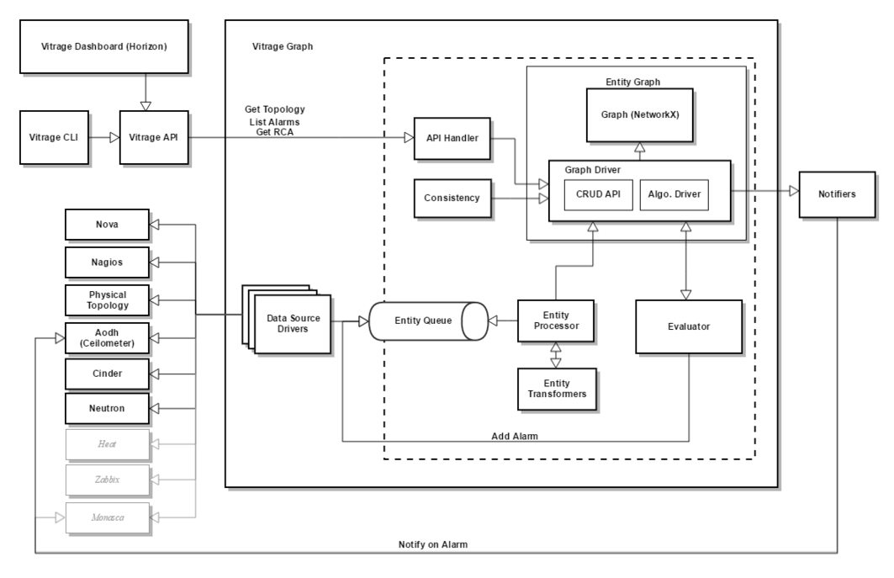
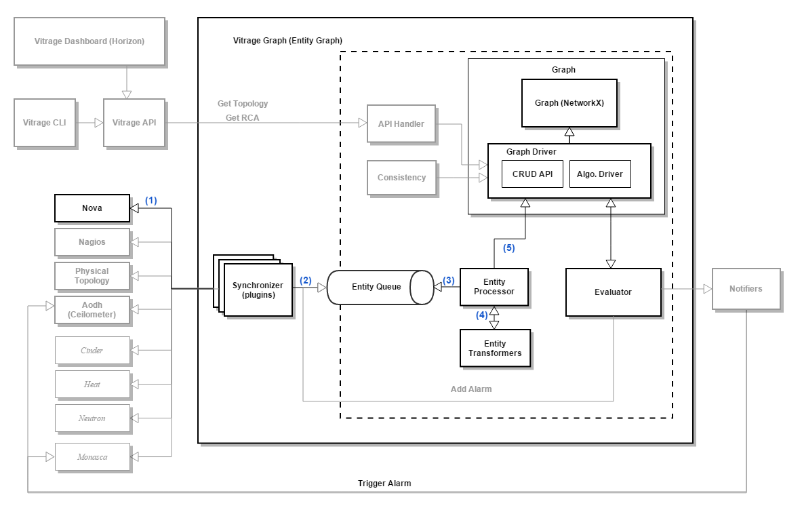
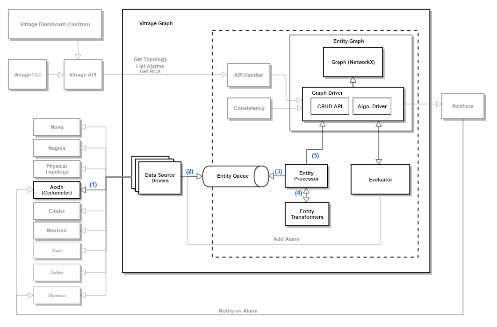
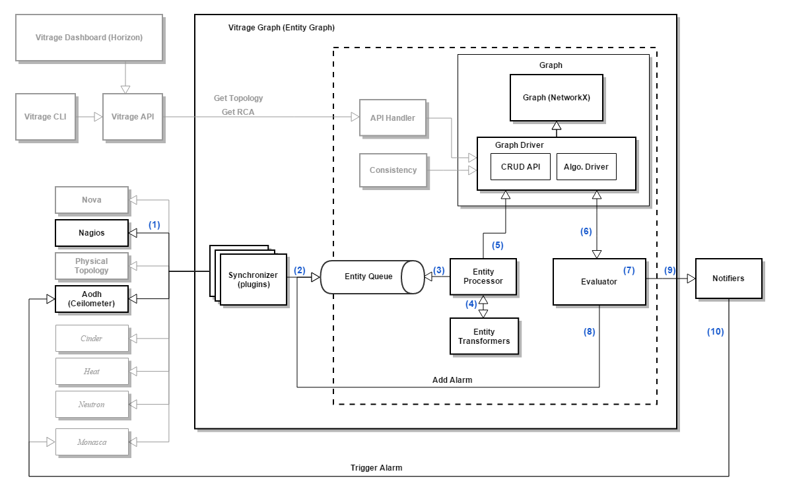
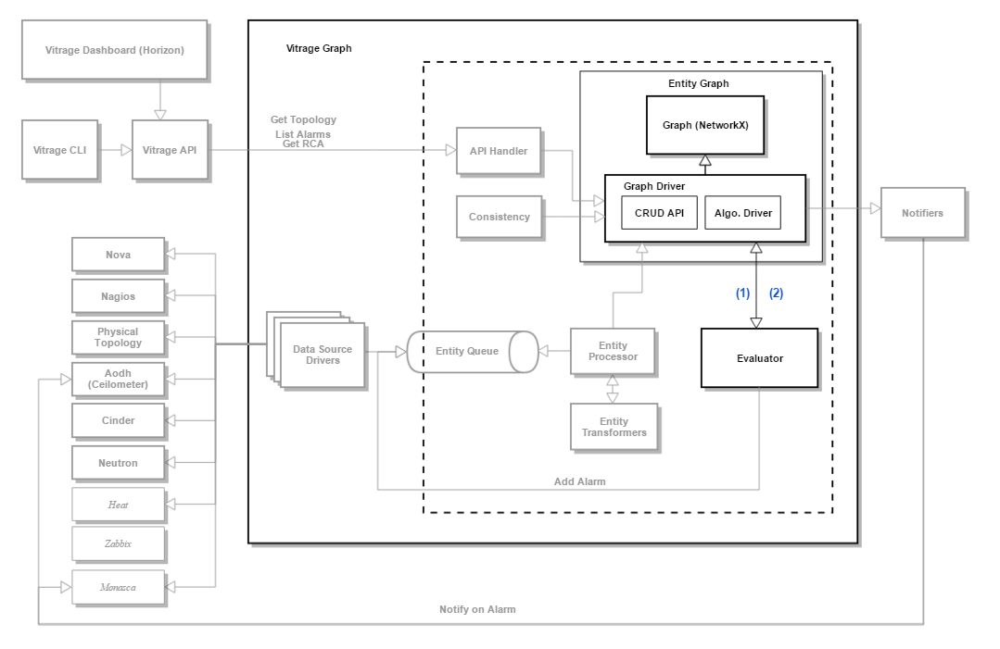
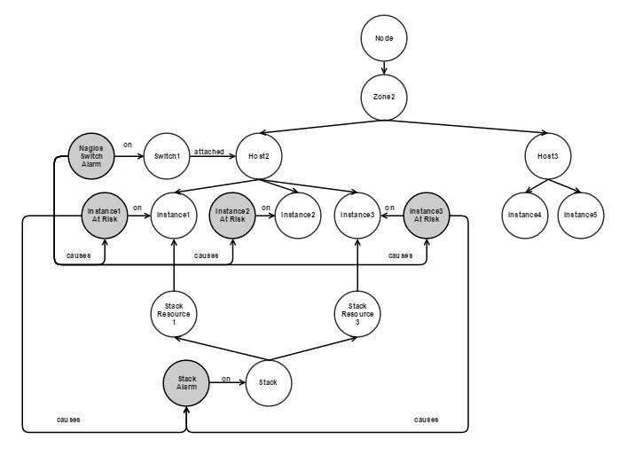

====================
Vitrage Graph Design
====================

Main Components
===============
**Note:** The gray plugins will not be implemented in Mitaka

Graph
-----
A library with a graph representation, that is used by Vitrage Graph and by Vitrage Evaluator.

The **Graph Driver** consists of APIs for graph CRUD actions (add/remove vertex, add/remove edge, etc.) and graph algorithms like DFS or sub-graph matching.
In Mitaka, the graph driver will be implemented over NetworkX. Future versions should support replacing NetworkX with a persistent graph DB such as Titan or Neo4J.

Synchronizer
------------
Responsible for importing information regarding entities in the cloud. Entities in this context refer both to resources (physical & virtual) and alarms (Aodh, Nagios, Monasca, etc.)

The Synchronizer can hold several plugins, each responsible for a different entity type, like Nova instance, Nova host, Nova zone, Nagios alarms, Aodh alarms, etc.

The plugin has two modes of action:

- get_all (snapshot): Query all entities and send events to the queue. When done, send an "end" event.
- notify: Send an event to the queue upon any change.

For more details, see https://github.com/openstack/vitrage-specs/blob/master/specs/mitaka/vitrage-synchronizer.rst

Entity Processor and Transformers
---------------------------------
Responsible for polling events from the entity queue and inserting corresponding vertices to the Graph. For every entity in the queue, the Processor calls the Transformer that is registered on this entity type. The Transformer plugin understands the specific entity details, queries the graph, and outputs a vertex to be inserted to the Graph together with edges that connect it to its neighbors.

Note that for every Synchronizer plugin there should be a matching Transformer plugin.

Evaluator
---------
The Evaluator is notified on every change in the Graph, and is responsible for executing templates that are related to this change.

Template Examples:

- Deduced alarm: In case an alarm is raised indicating a public switch is down, trigger an "instance is at risk" alarm on every instance that is contained by a host attached to this switch.
- RCA: In case an alarm is raised indicating a public switch is down, and an "instance is at risk" alarm is active on an instance that is contained by a host attached to this switch - determine that the switch alarm is the root cause of the instance alarm, and add a "causes" edge to the Graph from the vertex representing the switch to the vertex representing the instance.

Templates can be added, removed or modified by the user.

The Evaluator detailed design is still TBD.

Consistency
-----------
This component is responsible for verifying the Graph's consistency with the "real" situation in the cloud. It is called both during Vitrage startup, as part of the graph initialization, as well as periodically to ensure the graph is correct.

The consistency component will include:

- Deleting obsolete vertices
- Handle the case that Vitrage missed a "delete entity" event, and did not delete the relevant deduced alarms
- Ensure no entity is missed in the Graph. This can be done by retrieving all entities from all Synchronizer plugins.

Note: If an entity is added, its related templates will also be executed as well to create deduced alarms and add RCA information to the graph. This step will be handled differently during graph initialization and during periodic checks.

API Handler
-----------
Responsible for transferring Vitrage API calls to the Graph.

Notifiers
---------
Are called by the Evaluator, for example, in order to raise a Deduced Alarm. Each notifier is responsible to notify another component, like Aodh or Monasca, about alarm state changes.

Use Cases
=========
Use Case - Add Nova Instance
----------------------------

#. Nova Synchronizer plugin queries all Nova instances, or gets a message bus notification about a new Nova instance
#. Nova Synchronizer plugin sends corresponding events to the Entity Queue
#. The Entity Processor polls the Entity Queue and gets the new Nova Instance event
#. The Entity Processor passes the event to the Nova Instance Transformer plugin, which returns a Vertex with the instance data, and an edge to the host Vertex in the graph
#. The Entity Processor adds the new vertex and edge to the Graph

.. image:: ./images/add_nova_instance_graph.png
   :width: 100%
   :align: center

Use Case - Add Aodh Alarm
-------------------------

#. Aodh Synchronizer plugin queries all Aodh alarms, or gets a notification (TBD) about an Aodh alarm state change
#. Aodh Synchronizer plugin sends corresponding events to the Entity Queue
#. The Entity Processor polls the Entity Queue and gets the Aodh Alarm event, for example threshold alarm on Instance1 CPU
#. The Entity Processor passes the event to the Aodh Alarm Transformer plugin, which returns a Vertex with the alarm data, and an edge to the instance Vertex
#. The Entity Processor adds the new vertex and edge to the Graph

.. image:: ./images/add_aodh_alarm_graph.png
   :width: 100%
   :align: center

Use Case - Nagios Alarm Causes Deduced Alarm
--------------------------------------------

5.  (steps 1-5) Nagios Synchronizer plugin pushes a nagios alarm on a switch to the Entity Queue, which is converted by Nagios Transformer to a vertex and inserted to the Graph
6. The Evaluator is notified about a new Vertex (Nagios switch alarm) that was added to the graph
7. The Evaluator performs its calculations (TBD) and deduces that alarms should be triggered on every instance on every host attached to this switch
8. The Evaluator pushes alarms to the Entity Queue
9. The Evaluator asks the notifier to notify on these new alarms
10. Aodh Notifier creates new alarm definitions in Aodh, and sets their states to "alarm"

.. image:: ./images/nagios_causes_deduced_graph.png
   :width: 100%
   :align: center

Use Case - Create RCA Insights
------------------------------

#. The Evaluator is notified of a new alarm.
#. The Evaluator evaluates the templates and the Graph (TBD), and decides that there is a root cause relation between two alarms. It adds a "causes" edge to the Graph

.. image:: ./images/rca_graph.png
   :width: 100%
   :align: center

Note that in future versions the graph with RCA information may become more complex, for example:

