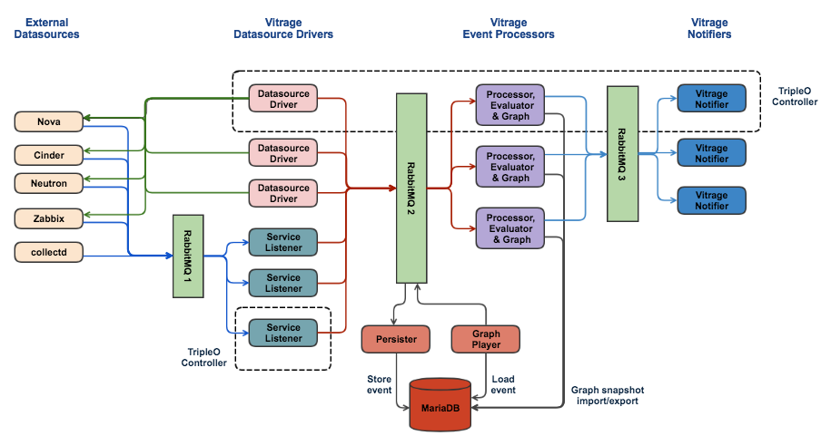

=============================
Vitrage HA and History Vision
=============================

Overview
========

In order to support some of the main future use cases of Vitrage, including
full HA support, alarm history and RCA history, we will need to make some
architectural changes.

This document contains the required use cases and a high level design for
supporting them.

Use Cases
=========

Full HA Support for Vitrage
---------------------------
Vitrage should have full HA support. There are different aspects that should be
considered:

* Vitrage should be able to recover and return to a consistent state after one
  of its instances failed.
* Notifications from external datasources (like Nova, Neutron, Zabbix, etc.)
  should not be lost, even if Vitrage is down.
* Notifications from Vitrage to external components (like Nova, SNMP) should be
  sent once Vitrage is recovered.
* The Sub-graph matching algorithm should recover in case Vitrage was down in
  the middle of the calculation.
* In order to support VNF use cases (like OPNFV Doctor), a notification from
  Vitrage should be sent within one second.

RCA History
-----------
**Note:** This use case covers only the RCA information. See also the next use
case of 'Alarm History'.

At the moment, Vitrage shows Root Cause Analysis only for alarms that are
currently triggered. We would like Vitrage to include also information for
alarms that were already disabled.

An example: If the host is down, then the instance is down, as well as an
application running on it. Later on, the problem of the host might be fixed,
but the application might not recover automatically. The cloud operator should
be aware of the fact that the alarm on the application resulted from the alarm
on the host (even though this alarm no longer exists).

Alarm History
-------------
Vitrage should keep alarm history for a specified period of time. This history
can be used for analytics or machine learning purposes, as well as to show the
user statistics about the alarms in the cloud.

**Note:** This use case is of a lower priority, and is not answered by the
current design. It can be implemented in the future by storing new tables with
alarms information in a relational database.

Vitrage Graph Performance
-------------------------
Vitrage should perform well under load. In order to support it, we might want
to introduce a persistent graph database as an alternative to the current
in-memory implementation with NetworkX.

There are several aspects to this decision:

* An in-memory implementation is usually faster than working against
  a persistent database
* A persistent database, on the other hand, allows multi processing

For now we believe that an in-memory graph database will be faster, so this
use case **does not** require introducing a persistent graph database.

Huge Entity Graph
-----------------
The in-memory NetworkX graph can work well with XXX number of vertices.
In order to support a bigger entity graph, we will have to switch to
a persistent graph database.

Vitrage Consistency
-------------------
The Vitrage entity graph must remain consistent even if Vitrage is down. Note
that this is usually the case with the current implementation, since the entity
graph is recalculated after every restart. The only exception is that the
collectd datasource does not have a 'get all' implementation and works only
by notifications, so after Vitrage recovers we won't have the alarms that were
previously reported by collectd.

Suggested Architecture
======================

The **datasource drivers** will be responsible for periodically querying the
external datasources for all of their resources/alarms. They are already
separated from the vitrage-graph process, and run in their own processes.
Upon failure of a **datasource driver**, another driver process will take over
calling the 'get all' method. A certain delay in the call is not crucial (as by
default this method is called every 10 minutes).

The **service listeners** will be responsible to get notifications from the
OpenStack message bus (**RabbitMQ1**), enrich them and pass them on to the
processors. Upon failure, the notifications will remain in the message bus
until another **service listener** gets them.

The current multi-processing queue between the **datasource drivers** and the
**processor** will be replaced with a RabbitMQ. That way, in case of failure in
a **processor**, the events will be kept in the RabbitMQ until they are
processed by another **processor**.

Events will arrive to the **RabbitMQ2** after the filter/enrich phase (done
either by the **datasource driver** or by the **service listener**). The
**processor** will pass the events to the transformer, as done today.

The **persister** process will also listen to the **RabbitMQ2** (on a different
topic) and will asynchronously write the events to a relational database. All
events will be stored after the filter/enrich phase. In the first version we
will support MariaDB, and we can support other databases if needed in the
future.

The **processor** will be responsible, when it is convenient (i.e. when it is
not busy handling events), to export the NetworkX graph as a **snapshot** into
MariaDB. The snapshot frequency should be determined by a combination of the
time that passed and the number of events that arrived since the last snapshot.

Reconstructing the graph from the historic data will be controlled by the
**processor**, and will be used in two cases:

* Upon failure, in order to initiate the standby processor
* For RCA history

The first phase of the graph reconstruction will be to identify the relevant
snapshot in MariaDB and import it. The second phase will be to **replay** all
of the events that happened from the time of the snapshot until the wanted time
for the graph reconstruction. Replaying the graph will be done by pushing the
relevant events to the **RabbitMQ2**, as if they arrived from the datasources
drivers or from the service listeners.

In order to support the RCA history use case, we will have to reconstruct the
graph on a separate graph instance and use a different RabbitMQ, while keeping
the current active graph intact.

How The architecture supports the different use cases
=====================================================

Full HA Support for Vitrage
---------------------------
In general, each component will manage its own HA.
Specific implementation is required for the **processor** process. If it fails,
a standby will take over. The standby will not be initialized from scratch;
instead, it will be initialized in the following way:

* Start with an empty graph
* Import the latest stored snapshot
* Replay all of the events from the time of the latest snapshot and on
* Start handling the newest events in the queue

**TBD:** While the processor was down, the persister kept storing events to the
database. When the standby processor takes over, the wanted behavior is:

* Do **not** send notifications on events that were already processed by the
  previously-active processor
* Send notifications on events that were not processed by the previously-active
  processor yet

We need a way to determine which events were processed and which were not. This
is relevant for the **Reliable Notification** feature that has been discussed
in the past, and will be handled as part of the implementation of this feature.

RCA History
-----------
Short-term RCA history (~1 day long) can be implemented with the current
architecture.

Implementation tasks:

* In the Consistency process (that is responsible for deleting old vertices),
  do not delete 'causes' vertices that are connected to non-deleted alarms.
* In the API, return also the disabled alarms with an indication about it.
* In the UI, display also the disabled alarms with an indication about it.

In order to query RCA for a longer period in the history, we will do the
following:

* Build a separate graph for that purpose
* Import to that graph the relevant snapshot, e.g. of Sep 14, 17:00
* Replay all of the events from the time of the snapshot until the wanted time
  in the past, e.g. Sep 14, 17:26
* Check the RCA information based on this graph

Alarm History
-------------
Will be implemented in the future, probably based on new information that will
be stored in the database.

Vitrage Graph Performance
-------------------------
Not affected by this architectural change. Whether a persistent graph DB should
be used will be discussed in a different document.

Huge Entity Graph
-----------------
Will require a persistent and distributed graph DB. Replacing the graph DB
should have no effect on the overall architectural change.

Vitrage Consistency
-------------------
A full consistency will be achieved by the new architecture, since every
un-processed notification will be stored in the RabbitMQ, and every processed
notification will be stored as an event in MariaDB.

Alternatives
============

Move the Service Listeners inside the Processor process
-------------------------------------------------------
The service listeners do very little, they call a single enrich method and pass
the event on to the RabbitMQ2. They do not have to run on separate processes.
The problem is that if we move the code inside the processor processes, we will
have two different sources of information to the processor:

* RabbitMQ1, before the driver processing
* RabbitMQ2, after the driver processing

The processor can handle this situation, the problem is with the persister. We
would like the persister to store only events after the driver processing, and
the easiest way to do so is by having all of the events pushed to RabbitMQ2.
